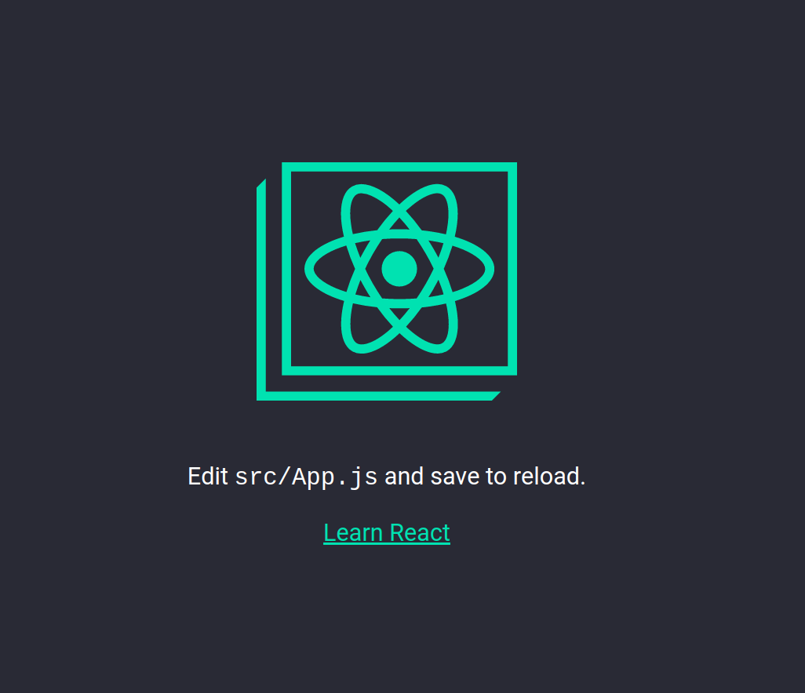
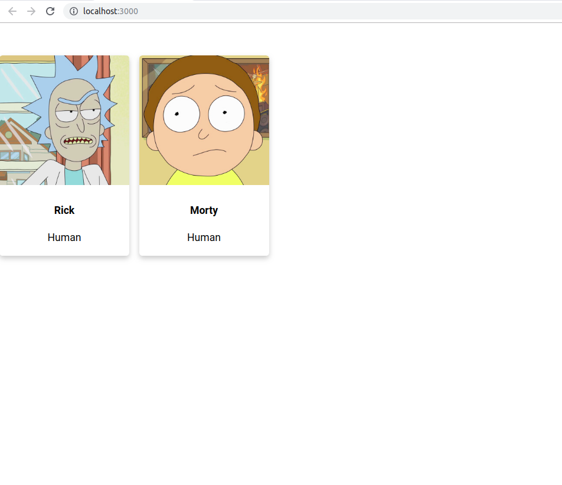

# How I built this

## Intro

The goal of this document is to mainly help new people follow along my implementation and to be the basis of future posts and presentations

## Create React App

The first step was simply to run Create React App on my machine. Follow the instructions on https://github.com/facebook/create-react-app, it is much better explained.

## Importing components
For the next step I copied over some components from my old repository https://github.com/RafaelFS/graphql-presentation. 

I won't go over the details on how they were created, but they form a simple grid of characters cards. You can find plenty of examples on how to do similar designs on https://codepen.io/. 

I chose to keep them in plain html and using css classes (no Styled Components) so it is easier to setup and folllow along.

## Mocking data
Alongside importing the old components, I also mocked some data to populate them. The images were selected by browsing the [Rick and Morty API](https://rickandmortyapi.com/) - more on that later.

